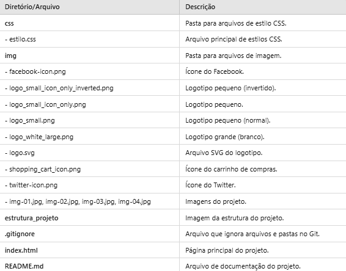

# 🎮 CP2_Play Games

* O CheckPoint consiste na criação de uma página web utilizando HTML e CSS, seguindo um protótipo previamente definido. 
  

## 📚 Etapas do Projeto

 📁 Criar um repositório no GitHub e configurar branches.

📝 Desenvolvimento do Protótipo: Analisar o protótipo e dividir tarefas.

🔧 Implementação: Cada membro desenvolve sua seção em sua branch.

👥 Revisão e Integração: Revisar trabalhos e integrar mudanças na branch principal.

🔍 Teste e Ajustes: Testar a página e corrigir erros.

📄 Documentação: Criar e atualizar o README.md.

## 📂 Estrutura do Projeto

## 🌟 Contribuidoras

- [**Alane Rocha rm561052**](https://github.com/alanerochaa)  
  *Responsável por:* Rodapé e README.md.

- [**Anna Beatriz Bonfim rm559561**](https://github.com/annabonfim)  
  *Responsável por:* Cabeçalho e Contato.

- [**Maria Eduarda Araujo rm560944**](https://github.com/DudaAraujo14)  
  *Responsável por:* Conteúdo.
